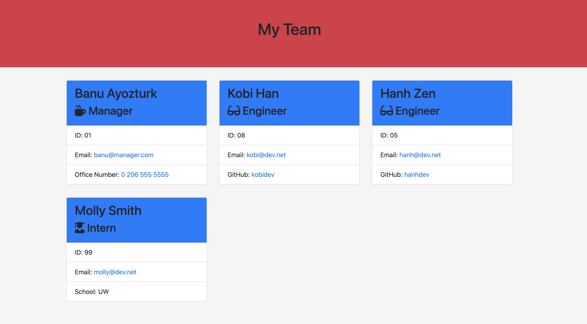

# team-profile-generator

## Description

I created a command-line application, that lists the people in a team. There are three categories: Manager, Engineer and Intern. Application generates an html page (named with the date generated) based on the input data. 

## Screenshot

## Installation 

Steps required to install project and how to get the development environment running:

First run **npm install** in order to install the following npm package dependencies in the package.json:

- <i>inquirer</i> that will prompt you for your inputs from the command line
- <i>utils</i> to print the answers (strings) 
- <i>jest</i> to run the tests

Invoked the application with **node app.js**.

## Usage

When you run node index.js, the application uses the inquirer package to prompt you in the command line with a series of questions about your your project.

The application then takes your responses and uses util module to provide some functions to print formatted strings as well to generate an html page.

## Credits and Libraries

 [jestjs.com-information about jest](https://jestjs.io/docs/getting-started)

 [stackoverflow-how to generate html](https://stackoverflow.com/questions/21617468/node-js-generate-html)

 [mozzilla.org-object oriented programming](https://developer.mozilla.org/en-US/docs/Learn/JavaScript/Objects/Object-oriented_JS)

 ## Contact Me
For any question about the project, please contact me.
[BanuAyozturk](mailto:bnyksl@gmail.com)

